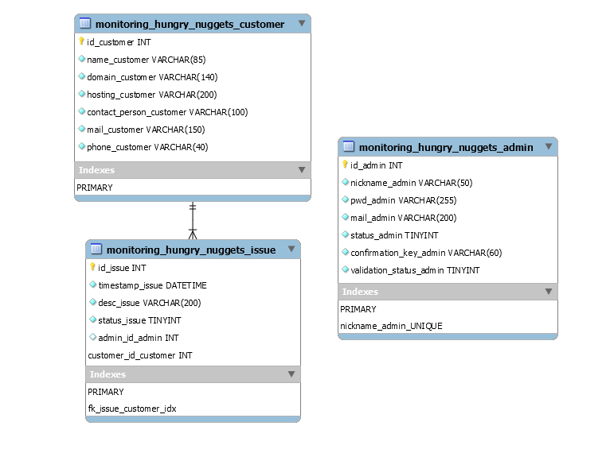

# Monitoring Hungry Nuggets

The purpose of this monitoring is to keep an eye on the health of the mutualized servers and DNS to be able to react as quickly as possible in the event of any issues with them. 

## URL

https://monitoring.hungrynuggets.com

## Test adress

On localhost

## Instructions 

- copy and rename the file config.php.local to config.php

- Import data/db/db_monitoring.sql 

## Description

__Database__ :

## Global project charter

- Main language of the project : `ENGLISH`

- Writing code in `OO language`

- Comment everything

- Use Pascal case for PHP class (`MyFavoriteClass`) and the same name into model with .php (`MyFavoriteClass.php`)
  
- Use Camel case for PHP methods (`myFavoriteMethod()`) and variables (`$myVariable`). 

- Use the pre-defined constant for the root  *( ex: `ROOT` )*

- MVC structure :
    - `model` : file containing the mapping class and their Managers with `SQL` queries *( ex: `Issue.php` and `IssueManager.php` )*
    - `controller` : file containing the transformation and security of data between the `Model` & `View` *( ex: `home.public.controller.php` )*
    - `view` : file containing the HTML that displays the content - file provided in the `view` folder. We used Twig for Templates ( ex: `home.html.twig`)
  
- Other structure :
  - `bin` : configuration files
  - `data` : useful files
  - `public` : content public files (front controllers, css, images, front javascript etc ...)

## OVH API

Every API request is in the CustomerManager.php, all request can be modified by changing the URL preceded by an `// API` comment.